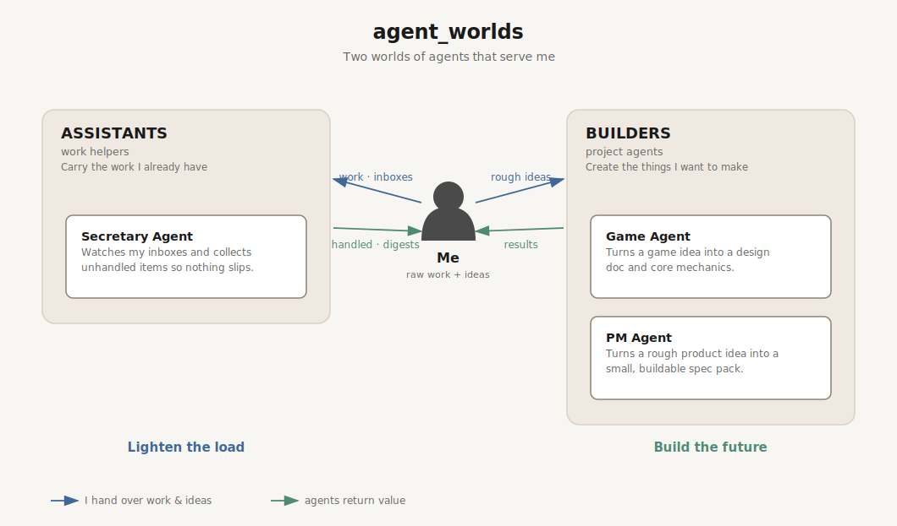

# agent_worlds

**English** · [中文](README.zh.md)

<p align="center">
  
</p>

A **one-person company of agents** — from a raw idea to a released feature.

Instead of a loose pile of agents, `agent_worlds` is organized like a company:

```
company → department → role → agent
```

The structure is declared once in [`company.yaml`](company.yaml). How the company
turns an idea into a release is **data, not a prompt** — it lives in
[`workflows/`](workflows/) as declarative steps.

## The idea

Most agent projects are a flat list of agents. The missing piece isn't more
agents — it's **organization**: who does what, in what order, handing what to whom.
So this repo models a company:

- **Departments** group roles by function (`product`, `engineering`, `quality`, `support`).
- **Roles** are the jobs (`pm`, `architect`, `qa`, …). In V1 each role is one agent.
- **Workflows** wire roles into a pipeline. Roles hand off via **artifact files** —
  the filesystem is the message bus. No service, no daemon.

> **Process is data.** To change how the company works, edit a workflow YAML —
> not a hidden prompt.

## Structure

```
agent_worlds/
├── company.yaml          the org: departments → roles (single source of truth)
├── CLAUDE.md             how to work in this repo (rules)
├── workflows/            how the company runs a job (process as data)
│   └── software_feature.yaml
├── departments/
│   ├── product/          pm · researcher
│   ├── engineering/      architect · backend · web · game
│   ├── quality/          qa
│   └── support/          secretary
└── diagrams/             generated org chart + pipeline (never hand-edited)
```

Each role lives at `departments/<dept>/<role>/` with an `agent.md` (the role) and,
when fleshed out, its methodology files — kept flat, or grouped in a `playbook/`
once there are several.

## The default workflow: `software_feature`

```
research → requirements → architecture → build (backend/web/game) → test → release
   pm·researcher    pm★         architect        engineering          qa     pm★
```

★ = owner checkpoint (`gate`). Each step `consumes` the upstream artifacts and
`produces` the next ones — e.g. `pm` writes `01_mvp_spec.md`, `architect` reads it.
See [`workflows/software_feature.yaml`](workflows/software_feature.yaml).

## Roles

| Department | Role | Status | One line |
|---|---|---|---|
| product | [pm](departments/product/pm/agent.md) | active | Turns a rough product idea into a small, buildable spec pack. |
| product | [researcher](departments/product/researcher/agent.md) | stub | Investigates the problem space before scope is locked. |
| engineering | [architect](departments/engineering/architect/agent.md) | stub | Turns a locked MVP spec into a system design and ADRs. |
| engineering | [backend](departments/engineering/backend/agent.md) | stub | Builds server-side logic, APIs, and data. |
| engineering | [web](departments/engineering/web/agent.md) | stub | Builds the web client. |
| engineering | [game](departments/engineering/game/agent.md) | stub | Turns a game idea into a design doc and core mechanics. |
| quality | [qa](departments/quality/qa/agent.md) | stub | Validates deliverables against acceptance criteria. |
| support | [secretary](departments/support/secretary/agent.md) | stub | Watches my inboxes and collects unhandled items. |

> **Stubs are intentional.** A stub role exists so the workflow runs end-to-end;
> flesh it out when a real job needs it — not before. `pm` is the reference shape
> of a complete role.

## Conventions

The ground rules every addition follows (full version in [`CLAUDE.md`](CLAUDE.md)):

1. **Role dir = role name**, kebab-case, no suffix (`pm/`, not `pm-agent/`). The
   department gives the namespace.
2. **`agent.md` opens with a role header** (`> **role:** … · **department:** …`)
   and a one-line summary.
3. **`company.yaml` is the single source of truth** for the org. The concept
   diagram reads it — nothing else defines departments/roles.
4. **Diagrams are generated, never hand-drawn** — run
   `python3 diagrams/generate_concept.py` after editing `company.yaml`.
5. **Bilingual lives only here** at the top level; role files are English (for the LLM).

## Adding to the company

- **New role**: create `departments/<dept>/<role>/agent.md`, add it under that
  department in `company.yaml`, regenerate the diagram.
- **New department**: add it to `company.yaml`, create the dir, add ≥1 role.
- **New workflow**: add `workflows/<name>.yaml`, reusing existing roles.

## Where this is going

V1 is deliberately light: files + one workflow, no runtime. The company grows by
being **used**, not over-architected. A thin orchestrator that *executes* a
workflow (dispatching each step to its role, gating on owner checkpoints) is the
natural next step — but only once the structure has earned it.
