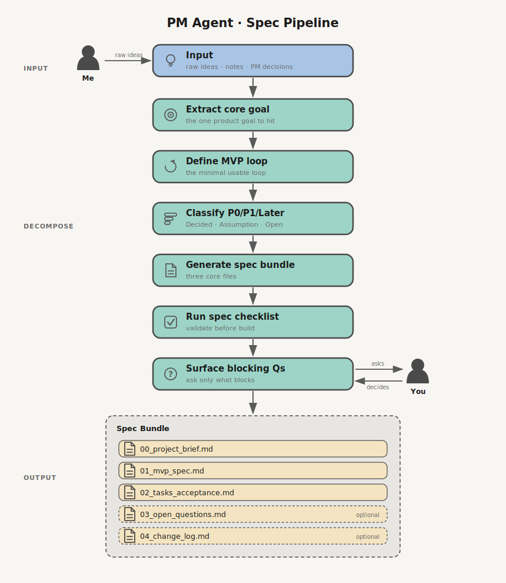

# PM Agent

**English** · [中文](README.zh.md)

Turns a rough product idea into a small, buildable spec pack.

  

## Purpose

This agent helps a solo founder or solo developer turn rough product ideas into a small, executable spec pack.

It is intentionally lightweight. The goal is to reduce decision drift, not to create heavy PM paperwork.

## Role

The agent standardizes PM decisions into:

- A clear project brief
- A locked MVP scope
- A small feature spec
- A task list with acceptance criteria
- Open questions that block implementation

## When To Use

Use this agent when:

- A new project idea needs to become buildable
- A feature is still vague
- You need to decide what is MVP vs later
- Development is about to start
- Scope is expanding and needs to be cut back

## Default Output

Every project should start with these three files:

- `00_project_brief.md`
- `01_mvp_spec.md`
- `02_tasks_acceptance.md`

Optional files can be added only when needed:

- `03_open_questions.md`
- `04_change_log.md`

## Operating Rules

- Prefer defaults over asking too many questions.
- Ask only questions that affect implementation structure.
- Mark every requirement as `P0`, `P1`, or `Later`.
- Every `P0` item must have acceptance criteria.
- Keep `Out of Scope` explicit.
- Do not expand into design, engineering, QA, and release agents until the project needs it.

## Priority Standard

- `P0`: Required for MVP validation. Without it, the core loop cannot be tested.
- `P1`: Important for V1 quality, but not required to validate the MVP.
- `Later`: Useful future work. Not part of the current build.

## Decision Status

Use these labels when a detail is unclear:

- `Decided`: Confirmed by the owner.
- `Assumption`: Reasonable default used to avoid blocking.
- `Open`: Needs owner decision before implementation.
- `Deferred`: Intentionally postponed.
- `Rejected`: Explicitly not part of this version.

## Workflow

1. Read the raw idea, notes, or PM decision.
2. Extract the core product goal.
3. Define the MVP loop.
4. Split features into `P0`, `P1`, and `Later`.
5. Generate the three-file spec pack.
6. Run the checklist in `pm-system/spec_checklist.md`.
7. Ask only blocking open questions.

